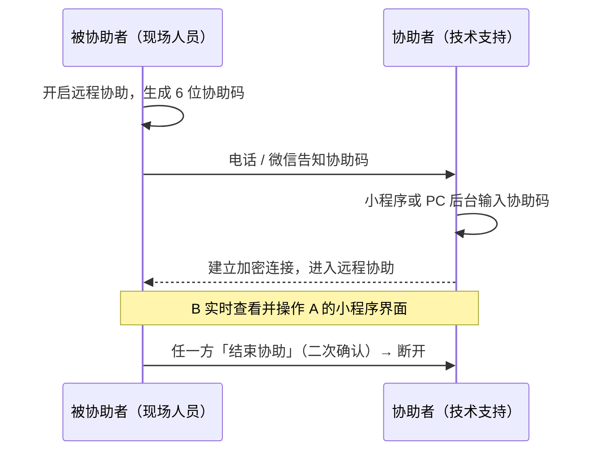

# 飞奕网关调试小程序 · 功能说明书

> [!info] 文档信息
> - **文档日期**：2026-08-05
> - **版本**：V1.0
> - **作者**：青岛飞奕科技 产品部
> - **主要内容**：飞奕网关调试小程序的完整功能定义，覆盖设备调试、E50 诊断、工具中心、远程协助及全局能力
> - **原型入口**：`demo.html` → `pages/tab-device-bt.html`

---

## 一、产品概述

飞奕网关调试小程序面向现场调试人员，提供飞奕全系列网关/控制器的近场蓝牙调试与远程 4G 调试能力，并内置工具中心辅助现场作业。当现场人员遇到不会操作的功能时，可通过「远程协助」由飞奕技术支持远程接管小程序完成调试。

**使用角色**

| 角色 | 说明 |
|---|---|
| 现场调试人员 | 主要使用者，在现场通过蓝牙/4G 连接设备完成配置与验证 |
| 飞奕技术支持 | 通过远程协助接管现场人员的小程序界面，代为完成调试 |

**支持型号矩阵**

| 型号 | 类别 | 调试连接 | 通道 | 快速配置项 |
|---|---|---|---|---|
| A01F / A02FG | 多通道室外机控制器 | 蓝牙 | 4 路 | 空调品牌批量配置、客户服务器设定、电表参数、空调控制验证 |
| A01E / A02EG | 多通道室外机控制器 | 蓝牙 | 8 路 | 同上 |
| A03FG | 多通道室外机控制器（4G 版） | 蓝牙 | 4 路 | 同上 |
| F16G | 室内机控制器（风机盘管） | 蓝牙 | 1 路 | 管制线阀类型、空调控制验证、固件升级 |
| B25LG | 室内机控制器（单路） | 蓝牙 | 1 路 | 空调品牌设置、空调控制验证、固件升级 |
| FD01G | 分体空调控制器（红外） | 蓝牙 | 1 路 | 码库匹配、客户服务器设定、电流检测、电量采集设置、空调控制、寻找设备（蜂鸣 3 轮） |
| S74G | 单路室外网关 | 蓝牙 | 1 路 | 空调品牌配置、客户服务器设定、空调控制验证 |
| E50 | 空调诊断设备 | 蓝牙 / 4G 双模式 | — | 专属配置向导流程（见第五章） |
| W01G / W01P | 冷水主机控制器 | — | 1 路 | 内容层产品（螺杆离心/风冷模块接入），不涉及本小程序调试流程 |
| 机房群控 | 冷水机房设备群控系统 | — | — | 一整套机房设备控制系统（非单一控制器），内容层方案展示 |

## 二、整体结构

```mermaid
flowchart TD
    A[飞奕网关调试小程序] --> B[设备 Tab]
    A --> C[工具 Tab]
    A --> D[我的 Tab]
    B --> B1[蓝牙搜索与连接<br/>10 型号产品卡 → 调试工作台]
    B --> B2[顶部搜索周边设备提示]
    C --> C1[氟机支持查询]
    C --> C2[空调接线 / 操作指引<br/>空调故障码 / 远程协助]
    C --> C3[更多服务：技术&服务(AI客服) / 留言反馈]
    A --> S[场景 Tab]
    S --> S1[产品方案场景卡<br/>→ 方案详情阅读页]
    D --> D1[账号信息 / 我的设备<br/>退出登录 / 版本号]
```

**全局能力**

| 能力 | 说明 |
|---|---|
| AI 智能助理 | 全局悬浮球（「奕」），可拖拽至屏幕左右边缘半隐藏停靠；点击打开对话窗，支持预设问答、文字输入、转人工客服 |
| 连接状态持久化 | 蓝牙/4G 连接状态写入 sessionStorage，跨页面导航保持连接（设备 Tab 重进直达工作台），断开需二次确认 |
| 调试页头部 | 统一 E50 风格：渐变蓝 hero 区 + 圆形浮动返回键 + 浮动半透明「☰ 更多功能」胶囊 + hero 内页面大标题（无传统白色顶栏） |
| 侧边栏菜单 | 全高窄栏（280px/76%）：顶部「切换其他产品」按钮（蓝牙模式=断开当前连接，二次确认后返回搜索列表）→ 设备功能导航（图标+文字行）→ 应用入口卡（工具/场景/我的，SVG 渐变图标，位于导航下方） |

## 三、设备调试（通用工作台）

> 适用型号：A01F / A01E / A02FG / A02EG / A03FG / F16G / B25LG / S74G（FD01G 与 E50 为专属流程，见后两章）

### 3.1 设备列表（设备 Tab）

- 仅保留蓝牙搜索与连接：10 个型号独立产品卡（产品图 + 型号），点击展开该型号附近蓝牙设备（名称、MAC、信号强度）
- **顶部搜索提示**：蓝色提示条引导现场人员确认设备已上电、处于配对状态且手机蓝牙已开启
- 点击「连接」进入该设备的调试工作台；E50、FD01G 进入各自专属流程
- **连接后设备 Tab 保持工作台**：蓝牙连接期间切换到工具/我的再点「设备」，直接回到当前产品的快速配置页，不重回搜索列表；仅主动断开（含「切换其他产品」，均需二次确认）或断连后才回到搜索主界面

> 原「4G 远程」子页（当前账号名下已绑定设备）已移至「我的 → 我的设备」，见第八章；旧链接自动重定向。

### 3.2 快速配置页

- **设备卡片**：型号 + 设备名、连接状态（蓝牙模式显示「断开连接」按钮，二次确认后返回列表）、设备图片，图片下方为「进入设备详情 ›」
- **快速任务列表**：按型号渲染（见型号矩阵），每项进入对应设置页；「空调控制验证」进入空调管理页
- 底部「更多配置」入口
- **操作指引**：顶部「更多功能」旁的胶囊按钮（与 E50 一致的位置与样式），进入当前产品所属系列的指引汇聚页（介绍视频 / 产品手册 / 方案文档 / 指导文件，见 7.2）；A01F/A01E 共用 A01 系列、A02FG/A02EG 共用 A02 系列，其余型号各自独立

### 3.3 设备详情页

- 完整参数表（≥12 行）：设备型号/名称、连接方式、在线状态、运行状态、固件/硬件版本、信号强度、设备时间、累计运行时间、空调品牌（F16G 为管制线阀类型）、已识别内机等；F16G 附加温度传感器补偿，室外机附加通道数量与电表通讯
- 下方汇总更多设置入口

### 3.4 更多配置页

- 快速配置项（图标列表形式）+ 更多设置项，全部按型号能力渲染

### 3.5 设置项 × 型号能力矩阵

| 设置项 | 适用型号 | 要点 |
|---|---|---|
| 空调品牌批量配置 | 室外机（A 系） | 按通道统一设置品牌 |
| 空调品牌设置（分通道） | 室外机（A 系） | 每通道独立品牌 + 协议属性（主/从）；品牌选「模拟器」时出现模拟器数量（1-160） |
| 客户服务器设定 | 室外机（A 系）、S74G | IP/域名双 Tab；本地 TCP / 云端 MQTT；JSON、MODBUSTCP_V2.6、MODBUSTCPCLIENT_V2.6、MODBUSRTU_V2.6；「保存并检测通讯」自动检测并反馈通讯状态 |
| 原厂服务器设定 | 室外机（A 系）、S74G、FD01G | 收入「更多配置」；表单与检测逻辑同客户服务器设定，用于切回出厂预置的原厂服务器 |
| 电表参数 | 室外机（A 系） | 电表类型、地址、波特率、数据位、校验位、协议（DL/T 645-2007 / Modbus RTU） |
| 管制线阀类型 | F16G | 2管制2线阀 / 2管制3线阀 / 4管制 |
| 温度传感器补偿 | F16G | 补偿正负 + 补偿温度值，附计算公式说明 |
| 网络参数 | 室外机（A 系）、S74G | DHCP / 静态 IP、本机 IP、子网掩码、网关 |
| RS485 / RTU | 室外机（A 系） | 从机地址、波特率、校验位 |
| 设备诊断 / 通信诊断 | 全型号 | 主控通讯、空调总线、网络通讯、存储器逐项检测 |
| 固件升级 | 全型号 | 当前/最新版本比对，已最新则提示 |
| 设备信息 | 全型号 | 序列号、MAC、生产日期 |
| 恢复默认设置 | F16G、B25LG | 恢复出厂参数（保留连接信息） |
| 空调高级参数 | F16G、B25LG、S74G | 工作模式、上报周期、故障复位 |

> 越权防护：通过 URL 伪造不支持的设置项或 4G 模式时，页面自动回退到该型号默认能力，不渲染越权内容。

### 3.6 空调管理（空调控制验证）

- **通道上方切换**：全选卡片之上一排通道切换按钮（通道数 >1 时显示），点击切换当前通道；每个通道可能挂载几十上百台内机，不再平铺展示（演示数据按每通道 8 台渲染）
- 内机卡片按机型类别切换图标；勾选、全选、批量控制弹层、全开 / 全关均**仅作用于当前通道**，切换通道后选择清空；各通道内机开关状态跨切换保留
- 不提供内机参数查看（仅 E50 诊断设备支持参数读取，见 5.2 / 5.5）

## 四、FD01G 分体机调试

工作台按「快速配置 + 设备详情 + 更多配置」三页组织（与标准产品架构一致），各功能屏由 view 子页承载。

### 4.1 快速配置

- **设备卡片**：型号 + 设备名、连接状态（「断开连接」按钮，二次确认后返回列表）、设备图片，图片下方为「进入设备详情 ›」
- **寻找设备（FD01G 独有）**：设备卡片内按钮，按下后设备蜂鸣 3 轮（按钮轮播「蜂鸣中 · 第 N/3 轮」，完成后 toast 提示）
- **任务行**：码库匹配 / 客户服务器设定 / 电流检测 / 电量采集设置 / 空调控制（单台分体空调）

### 4.2 设备详情

- **设备参数**：设备型号、设备编号（SN）、设备名称、连接方式、在线状态、固件/硬件版本、信号强度、设备时间、空调码库
- **服务器配置信息**：服务器类型、协议类型、服务器域名、端口、用户名、发布/订阅主题（只读）

### 4.3 更多配置

- 原厂服务器设定、固件升级、红外学习、重启设备（二次确认）、恢复出厂设置（警示块 + 二次确认）

### 4.4 功能屏说明

| 功能屏 | 说明 |
|---|---|
| 码库匹配 | 品牌搜索 + 热门品牌，逐套测试红外码组（第 N/8 套），确认「空调是否正确响应」，不响应切换下一套 |
| 客户服务器设定 | IP / 域名双 Tab 表单（类型/协议/端口/账号/发布订阅主题），保存并检测通讯 |
| 电流检测 | 一键检测，实时电流值 + 柱状曲线，完成后生成检测结果（关机/运行电流、阈值、运行判定） |
| 电量采集设置 | 实时电量（电压/电流/功率/累计电量）+ 采集配置（周期、校准系数）+ 电流阈值（≥50 mA 校验） |
| 空调控制 | 单台分体空调卡（当前码库/温度/模式），弹层发送红外指令（温度/模式/风速/开关） |
| 红外学习 | 选择学习按键 → 对准遥控器按键 → 识别保存 |

## 五、E50 空调诊断

### 5.1 配置向导（三步）

1. **连接设备**：搜索附近 E50（蓝牙配对引导），连接后可切换 蓝牙 / 4G 模式（切 4G 需断开蓝牙，二次确认）
2. **选择空调品牌**：品牌搜索 + 热门品牌 + 码库测试入口（查看接线图跳转换线指导）；「模拟器」品牌支持自定义模拟内机数量（1-160）
3. **搜索空调**：模拟内机 / 模拟外机 / 直接搜索三种方式；搜索倒计时进度展示，完成后识别空调系统（室外机模块主/从、室内机数量）

向导状态持久化，已完成步骤显示摘要并支持「重新搜索 / 重新选择」。

### 5.2 参数详情

- 室外机 / 室内机参数全量展示（20+ 行），异常行标红高亮
- 多台内机横向滑动对比（首屏滑动引导提示）
- 蓝牙模式下可查看「设备信息」弹窗（设备标识、SN、软件版本、授权状态、空调品牌、4G 信号）
- 底部操作：导出文件 / AI 诊断

### 5.3 AI 空调医生

- 基于当前机器快照一键诊断，输出故障项 + 概率分布 + 建议（内机模拟状态不可诊断）
- 支持多轮对话（文字 / 语音按住说话）、对话历史管理、每条结论可反馈「已解决 / 未解决」并可补充描述
- 可跳转生成完整诊断报告

### 5.4 诊断报告

- FAULTS 故障分析：每个故障含可能原因与排查步骤
- 附设备参数快照，支持「保存报告为图片」

### 5.5 空调控制

- 内机列表多选（全选），批量控制弹层：温度步进、运行模式（自动/制冷/制热/送风/除湿等 10 档）、风速（8 档）、风向（扫风 + 6 档定向）
- 参数查看跳转多机对比详情

### 5.6 其他

| 功能 | 说明 |
|---|---|
| 固件升级 | 发现新版本 → 立即升级 → 升级成功流程 |
| 我的设备 | E50 绑定列表，在线/离线状态，支持解绑 |
| 技术&服务 | 技术支持对话，可转人工客服 |
| 操作指引 | 视频指引占位 |
| 检修抓码 | 侧边栏唤起：抓码原因（选择/补充说明 + 照片）→ 抓码进度 → 完成 |

## 六、场景 Tab（场景应用）

- 底部栏顺序：设备 / 工具 / 场景 / 我的
- **定位**：飞奕产品方案的场景化展示，与「操作指引」分工——场景 Tab 只做方案展示，不涉及具体操作指引
- **场景卡**（5 张）：办公楼多联机节能场景、校园场景空调管理、娱乐场所·酒店场景、娱乐场所·网吧场景、公共建筑场景；卡片标注场景空调类别与飞奕对应网关产品
- 点击场景卡进入**场景详情页**：标题区下方预留**场景介绍视频位**（每个场景配一条介绍视频），随后场景痛点、解决方案、落地价值（节能率承诺与案例数据）分区展示；页面最下方为**涉及产品**（产品图 + 系列名），点击跳转对应产品方案介绍页（见 7.2）

## 七、工具中心

| 工具 | 说明 |
|---|---|
| 支持查询（hero 大卡） | 区分氟机/水机查询：氟机输入空调品牌 + 外机完整型号；水机选择机型类别（螺杆离心/风冷模块）与检索方式（按主机型号/按主机线控器型号），品牌覆盖约克、开利、麦克维尔、特灵、格力、美的、天加、海尔等主流品牌 → 已收录：支持接入（氟机：空调接线、主从判断、安装调试视频入口；水机：适配 W01G/W01P 控制器与接线要点）；未收录：引导留言反馈（铭牌照片、电路图说明） |
| 空调接线 | 按品牌筛选的接线图文文章聚合 |
| 操作指引 | 操作指引总页（见 7.1），汇聚硬件产品专栏与平台操作专栏 |
| 空调故障码 | 选择空调品牌后查询故障代码含义与处理方法（常见原因 + 现场排查步骤） |
| 远程协助 | 见 7.3 |
| 更多服务 | 技术&服务（点击直接进入 AI 客服对话）、留言反馈 |

### 7.1 操作指引总页

- **硬件产品专栏**：按系列维护 8 个专栏（A01 系列、A02 系列、A03FG、F16G、B25LG、FD01G、S74G、E50），点击进入该系列的产品指引汇聚页
- **平台操作专栏**：平台侧操作视频按四类别组织——常用集控操作（11 条）、项目调试维护（6 条）、节能策略相关（2 条）、分户计费相关（7 条），点击类别进入对应视频清单页（标题 + 内容简介）

### 7.2 产品指引汇聚页

- 每个产品系列一个汇聚页，包含：产品形象与简介、**介绍视频**、**手册与文档**（产品手册 / 方案文档 / 指导文件）；文档点击进入**阅读页**（页面化展示章节目录、正文与参数表，非文件附件形式）
- 系列合并规则：A01F/A01E → A01 系列，A02FG/A02EG → A02 系列（仅通道数差异，方案一致），其余型号独立维护
- 入口：设备页底部产品方案推广卡、工具页「操作指引」、快速配置页顶部「操作指引」按钮（自动对应当前产品系列）；原「产品方案」列表页重定向至操作指引总页

### 7.3 远程协助

现场调试人员遇到不会操作的功能时，开启协助码邀请飞奕技术支持远程接管其小程序界面，代为完成调试。

> [!important] 核心原则
> - 技术支持**仅能查看和操作本小程序**，无法访问被协助者手机的其他应用程序
> - 被协助者**开启协助码后**才可被远程接入，未开启任何人无法连接
> - 协助全程**任意一方均可随时结束**连接

**角色与入口**

| 角色 | 使用端 | 入口 |
|---|---|---|
| 被协助者（现场调试人员） | 手机小程序 | 工具 → 远程协助 → 请求协助 |
| 协助者（飞奕技术支持） | 手机小程序 / PC 端后台 | 工具 → 远程协助 → 协助他人；PC 端见下文「PC 端协助」 |

**配对流程（6 位协助码）**



**被协助者界面**

| 状态 | 界面要点 |
|---|---|
| 未开启 | 三步引导 + 安全与隐私说明 + 「开启远程协助」按钮 |
| 等待接入 | 6 位协助码大字号展示 + 复制 + 10 分钟有效期提示 + 等待动画；可取消 |
| 协助中 | 页面保持正常小程序操作画面，仅顶部叠加红色呼吸状态条「远程协助中 · 技术支持正在操作您的小程序」，条内右侧紧跟「结束协助」按钮（二次确认后断开） |

**协助者界面**

| 状态 | 界面要点 |
|---|---|
| 输入协助码 | 6 位数字输入（位数校验）+ 索取指引 + 「连接」按钮 |
| 连接中 | 加密连接 loading |
| 远程桌面 | 对方信息条（人员/设备/连接状态/延迟）+ 操作范围提示 + 对方屏幕实时镜像（可直接点击操作）+ 底部常驻红色「结束协助」（二次确认） |

**PC 端协助**

> [!note] 本节仅作功能说明，不体现在小程序原型界面中

- 技术支持除手机小程序外，也可在 **PC 端「飞奕云平台后台 → 远程协助」** 输入同一 6 位协助码接入
- PC 端与小程序端协助能力一致：实时查看被协助者小程序界面、远程点击操作、随时结束协助
- PC 端画面更大、键鼠操作更便捷，适合长时间协助与复杂参数配置场景
- 同一协助码同一时间仅允许一个协助端接入，小程序端与 PC 端互斥，先接入者占用会话

**安全约束**

| 约束 | 说明 |
|---|---|
| 操作范围 | 仅被协助者的小程序界面，无法访问其他应用、文件与系统设置 |
| 协助码时效 | 6 位数字，10 分钟内有效，一次性使用 |
| 过程可见 | 被协助者全程可见协助者每一步操作 |
| 随时终止 | 任一方确认结束后连接立即断开，协助者即刻失去操作权限 |
| 传输安全 | 协助连接全程加密 |

## 八、我的

- **账号信息卡**：左侧头像，右侧账号名（飞奕工程师 · 张工）与手机号（138****8203）；账号名与手机号均通过微信授权获取
- **我的设备**：入口行（含设备数量），点击进入「我的设备」列表页（样式与 E50 设备列表一致）：设备图、名称、编号、更新时间、在线状态徽章；在线设备可「进入调试」（4G 远程模式，仅 E50 支持），支持「解绑」（二次确认）
- **退出登录**：我的设备下方，二次确认后清除连接状态并返回启动页（退出后需重新微信授权登录，已连接设备断开）
- **版本号**：退出登录按钮正下方居中显示（2.0.0）

## 九、原型演示说明

- **形态**：静态 HTML + CSS + 原生 JS，无后端；设备数据为内置模拟数据，连接/配置状态经 sessionStorage 跨页保持
- **远程协助演示**：被协助者开启协助码后约 3.5 秒自动模拟技术支持接入；协助者输入任意 6 位数字即可连接；远程桌面为静态模拟镜像，点击镜像配置项反馈「已远程点击：XXX」
- **过程模拟**：空调搜索倒计时、固件升级、通讯检测、电流检测等均为加速演示动画，以 toast/结果框反馈成功态
- **旧链接兼容**：历史页面路径通过重定向页保留，自动跳转至现行页面对应视图
